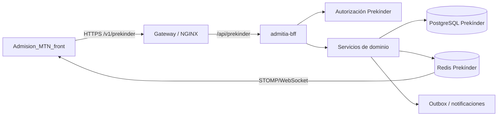

# Contrato de integración Backend–Frontend — Admisión Prekínder MTN

**Estado:** propuesta técnica para implementación backend  
**Destino:** equipo backend `admitia-bff`  
**Frontend de referencia:** `Admision_MTN_front`, rama `codex/prekinder-integration`  
**Base objetivo:** base PostgreSQL independiente de Prekínder  
**Última actualización:** 2026-08-09

## 1. Objetivo

Definir los contratos, clases, roles, permisos, migraciones y reglas necesarios para conectar las pantallas de Prekínder implementadas en el frontend con `admitia-bff` y la base de datos independiente de Prekínder.

El alcance comprende:

- administración del proceso y postulaciones;
- torre de control, recepción y monitor de avance;
- planificación de salas, bloques y grupos;
- consolas de evaluación por especialidad;
- captura simultánea e individual de pautas;
- derivaciones a Apoyo al Aprendizaje y DAP;
- revisión, validación, puntuación y resultados;
- auditoría, concurrencia y actualización en tiempo real.

El frontend **no debe conectarse directamente a PostgreSQL**. Toda lectura y escritura pasa por el BFF.

## 2. Arquitectura esperada



Variables de conexión existentes:

```text
PREKINDER_ENABLED=true
PREKINDER_DATASOURCE_URL=jdbc:postgresql://host:port/database
PREKINDER_DATASOURCE_USERNAME=...
PREKINDER_DATASOURCE_PASSWORD=...
PREKINDER_REDIS_URL=redis://...
```

No almacenar secretos en Git ni enviarlos al frontend.

## 3. Estado actual que debe reutilizarse

Las migraciones `V1` a `V4` ya crean gran parte del dominio.

### 3.1 Entidades reutilizables sin duplicación

| Área | Tablas existentes |
|---|---|
| Proceso | `admission_processes`, `workflow_stages`, `process_waves` |
| Postulación | `families`, `applicants`, `applications`, `application_state_history` |
| Elegibilidad | `eligibility_declarations` |
| Inclusión | `inclusion_records`, `inclusion_record_revisions` |
| Formularios | `form_templates`, `form_template_versions`, `form_submissions` |
| Profesionales | `actors`, `professional_profiles`, `professional_availability` |
| Jornadas | `evaluation_days`, `evaluation_blocks`, `prekinder_rooms` |
| Grupos | `evaluation_groups`, `evaluation_group_members` |
| Reservas | `applicant_group_bookings`, `evaluator_group_bookings` |
| Asignaciones | `group_evaluator_assignments`, `group_assignment_history` |
| Pautas | `evaluation_templates`, `evaluation_template_versions`, `evaluation_criteria`, `evaluation_options` |
| Informes | `evaluator_reports`, `evaluator_report_responses`, `evaluator_report_notes` |
| Derivaciones | `referrals`, `referral_revisions`, `support_records`, `support_record_revisions` |
| Datos restringidos | `restricted_case_access_grants`, `encrypted_field_values`, `evaluation_fields` |
| Puntajes | `scoring_policies`, `application_score_snapshots` |
| Comité | `committee_dossiers`, `committee_decisions`, `committee_review_tasks` |
| Auditoría | `audit_events`, `outbox_events`, `processed_operations` |

### 3.2 Endpoints existentes que deben conservarse

El gateway expone `/v1/prekinder/...`; internamente los controladores usan `/api/prekinder/...`.

- procesos, publicación y etapas;
- postulaciones y elegibilidad;
- profesionales y disponibilidad;
- salas y grupos;
- configuración y cambio de horario del grupo;
- agregar integrante y evaluador;
- confirmar/completar grupo;
- agenda personal;
- lectura y escritura de informes, criterios y notas;
- decisiones, publicación, dashboard, pautas y auditoría;
- documentos, comentarios y eventos en tiempo real.

No se recomienda crear otro módulo paralelo para las nuevas pantallas.

## 4. Decisiones de diseño obligatorias

### 4.1 Modelo canónico de jornada

Usar como modelo canónico:

```text
evaluation_days
  └── evaluation_blocks
        └── evaluation_groups
              ├── evaluation_group_members
              └── group_instrument_assignments
```

Las tablas antiguas `schedules`, `schedule_rooms`, `schedule_slots` y `schedule_assignments` no deben recibir escrituras desde el flujo nuevo. Si aún tienen consumidores, definir una migración o vista de compatibilidad.

### 4.2 Instrumento distinto de rol

No utilizar `professional_profiles.specialty` como autorización. Es un texto libre.

Crear códigos estructurados:

```text
ACADEMIC
PSYCHOMOTOR
PSYCHOLOGY
ENTRY_INDICATORS
GROUP_OBSERVATION
LEARNING_SUPPORT
DAP
```

Un usuario puede tener más de un rol y más de un instrumento autorizado. Las autorizaciones deben ser por proceso y no depender exclusivamente del rol global del usuario.

### 4.3 Una captura grupal genera resultados individuales

Académico, Psicomotricidad, Indicadores de ingreso y Observación grupal muestran tres postulantes simultáneamente, pero el backend debe crear un informe individual por:

```text
grupo + postulante + instrumento
```

Psicología, Apoyo al Aprendizaje y DAP utilizan la misma unidad persistente, aunque la interfaz presenta un postulante a la vez.

### 4.4 Pautas versionadas e inmutables

- Una evaluación siempre referencia una versión publicada de pauta.
- Publicar una versión nueva no altera informes anteriores.
- No permitir editar criterios u opciones de una versión publicada.
- `NOT_OBSERVED` es distinto de valor cero.
- Una pauta incompleta no genera un resultado definitivo.

## 5. Roles y permisos

### 5.1 Roles propuestos

| Código | Función |
|---|---|
| `PK_ADMIN` | Configuración integral del proceso |
| `PK_COORDINATOR` | Torre de control, grupos, asignaciones e incidencias |
| `PK_RECEPTION` | Asistencia y consulta de destino |
| `PK_EVALUATOR_ACADEMIC` | Pauta académica |
| `PK_EVALUATOR_PSYCHOMOTOR` | Pauta de psicomotricidad |
| `PK_EVALUATOR_PSYCHOLOGY` | Pauta individual de psicología |
| `PK_EVALUATOR_ENTRY_INDICATORS` | Indicadores de ingreso |
| `PK_EVALUATOR_GROUP_OBSERVATION` | Observación grupal |
| `PK_EVALUATOR_LEARNING_SUPPORT` | Casos derivados de apoyo |
| `PK_EVALUATOR_DAP` | Casos DAP restringidos |
| `PK_DATA_ENTRY` | Digitación de pauta en papel |
| `PK_REVIEWER` | Validar o devolver informes |
| `PK_COMMITTEE` | Expediente y propuesta de decisión |
| `PK_FINAL_APPROVER` | Aprobación y bloqueo final |
| `PK_AUDITOR` | Lectura de auditoría, sin edición |

### 5.2 Matriz resumida

| Acción | Admin | Coordinación | Recepción | Evaluador | Revisor | Comité |
|---|---:|---:|---:|---:|---:|---:|
| Configurar proceso | Sí | No | No | No | No | No |
| Crear/mover grupos | Sí | Sí | No | No | No | No |
| Registrar asistencia | Sí | Sí | Sí | Confirmar asignados | No | No |
| Ver pauta asignada | Sí | Estado | No | Solo propia | Sí | Resumen |
| Editar respuestas | Excepción | No | No | Propia y abierta | Devolver, no editar | No |
| Ver notas sensibles | Con grant | No por defecto | No | Según instrumento/grant | Con grant | Resumen autorizado |
| Validar informe | No autor del informe | No | No | No | Sí | No |
| Decidir admisión | No por pauta | No | No | No | No | Sí |
| Aprobar nómina | No | No | No | No | No | Aprobador final |

### 5.3 Tabla nueva para roles por proceso

```sql
CREATE TABLE prekinder_actor_role_assignments (
    assignment_id UUID PRIMARY KEY,
    process_id UUID NOT NULL REFERENCES admission_processes(process_id),
    actor_id UUID NOT NULL REFERENCES actors(actor_id),
    role_code VARCHAR(64) NOT NULL,
    active BOOLEAN NOT NULL DEFAULT TRUE,
    valid_from TIMESTAMPTZ NOT NULL DEFAULT now(),
    valid_until TIMESTAMPTZ,
    assigned_by UUID NOT NULL REFERENCES actors(actor_id),
    version BIGINT NOT NULL DEFAULT 0,
    created_at TIMESTAMPTZ NOT NULL DEFAULT now(),
    CHECK (valid_until IS NULL OR valid_until > valid_from)
);

CREATE UNIQUE INDEX uq_pk_active_actor_role
ON prekinder_actor_role_assignments(process_id, actor_id, role_code)
WHERE active;
```

## 6. Migraciones de base de datos propuestas

### 6.1 Catálogo de instrumentos

```sql
CREATE TABLE evaluation_instruments (
    instrument_code VARCHAR(64) PRIMARY KEY,
    display_name VARCHAR(160) NOT NULL,
    capture_mode VARCHAR(24) NOT NULL
        CHECK (capture_mode IN ('GROUP_PARALLEL','INDIVIDUAL','DERIVED_INDIVIDUAL')),
    sensitive BOOLEAN NOT NULL DEFAULT FALSE,
    active BOOLEAN NOT NULL DEFAULT TRUE,
    position INTEGER NOT NULL
);
```

Semilla mínima:

| Código | Modo | Restringido |
|---|---|---:|
| `ACADEMIC` | `GROUP_PARALLEL` | No |
| `PSYCHOMOTOR` | `GROUP_PARALLEL` | No |
| `PSYCHOLOGY` | `INDIVIDUAL` | Sí |
| `ENTRY_INDICATORS` | `GROUP_PARALLEL` | No |
| `GROUP_OBSERVATION` | `GROUP_PARALLEL` | No |
| `LEARNING_SUPPORT` | `DERIVED_INDIVIDUAL` | Sí |
| `DAP` | `DERIVED_INDIVIDUAL` | Sí |

### 6.2 Autorización profesional por instrumento

```sql
CREATE TABLE professional_instrument_authorizations (
    authorization_id UUID PRIMARY KEY,
    process_id UUID NOT NULL REFERENCES admission_processes(process_id),
    professional_id UUID NOT NULL REFERENCES professional_profiles(professional_id),
    instrument_code VARCHAR(64) NOT NULL REFERENCES evaluation_instruments(instrument_code),
    active BOOLEAN NOT NULL DEFAULT TRUE,
    valid_from TIMESTAMPTZ NOT NULL DEFAULT now(),
    valid_until TIMESTAMPTZ,
    authorized_by UUID NOT NULL REFERENCES actors(actor_id),
    version BIGINT NOT NULL DEFAULT 0,
    created_at TIMESTAMPTZ NOT NULL DEFAULT now()
);

CREATE UNIQUE INDEX uq_active_professional_instrument
ON professional_instrument_authorizations(process_id, professional_id, instrument_code)
WHERE active;
```

### 6.3 Asignación de instrumento a grupo

La tabla actual `group_evaluator_assignments` no indica especialidad. Se recomienda crear una entidad explícita y mantener la tabla actual como compatibilidad temporal.

```sql
CREATE TABLE group_instrument_assignments (
    assignment_id UUID PRIMARY KEY,
    group_id UUID NOT NULL REFERENCES evaluation_groups(group_id),
    instrument_code VARCHAR(64) NOT NULL REFERENCES evaluation_instruments(instrument_code),
    evaluator_id UUID NOT NULL REFERENCES actors(actor_id),
    template_version_id UUID NOT NULL
        REFERENCES evaluation_template_versions(evaluation_template_version_id),
    status VARCHAR(24) NOT NULL DEFAULT 'ACTIVE'
        CHECK (status IN ('ACTIVE','REPLACED','CANCELLED')),
    assigned_by UUID NOT NULL REFERENCES actors(actor_id),
    assigned_at TIMESTAMPTZ NOT NULL DEFAULT now(),
    ended_at TIMESTAMPTZ,
    version BIGINT NOT NULL DEFAULT 0
);

CREATE UNIQUE INDEX uq_active_group_instrument
ON group_instrument_assignments(group_id, instrument_code)
WHERE status = 'ACTIVE';
```

Debe crear o actualizar también la reserva horaria del evaluador.

### 6.4 Informes por instrumento

Modificar `evaluator_reports`:

```sql
ALTER TABLE evaluator_reports
    ADD COLUMN instrument_assignment_id UUID
        REFERENCES group_instrument_assignments(assignment_id),
    ADD COLUMN instrument_code VARCHAR(64)
        REFERENCES evaluation_instruments(instrument_code),
    ADD COLUMN submitted_at TIMESTAMPTZ,
    ADD COLUMN validated_at TIMESTAMPTZ,
    ADD COLUMN validated_by UUID REFERENCES actors(actor_id),
    ADD COLUMN returned_at TIMESTAMPTZ;
```

Estados requeridos:

```text
PENDING
IN_PROGRESS
SUBMITTED
RETURNED
VALIDATED
LOCKED
REOPENED
SUPERSEDED
CANCELLED
```

La unicidad objetivo debe ser:

```text
group_id + application_id + instrument_code + versión vigente
```

El reemplazo de un evaluador no debe generar dos resultados activos para el mismo instrumento.

### 6.5 Observación por criterio

La nota actual es única por informe. Para observaciones breves por criterio/postulante agregar:

```sql
CREATE TABLE evaluator_report_response_notes (
    response_note_id UUID PRIMARY KEY,
    report_id UUID NOT NULL REFERENCES evaluator_reports(report_id),
    criterion_id UUID NOT NULL REFERENCES evaluation_criteria(criterion_id),
    ciphertext TEXT NOT NULL,
    iv VARCHAR(64) NOT NULL,
    wrapped_dek TEXT NOT NULL,
    wrapped_dek_iv VARCHAR(64) NOT NULL,
    key_version VARCHAR(32) NOT NULL,
    version BIGINT NOT NULL DEFAULT 0,
    operation_id UUID NOT NULL UNIQUE,
    updated_by UUID NOT NULL REFERENCES actors(actor_id),
    updated_at TIMESTAMPTZ NOT NULL DEFAULT now(),
    UNIQUE (report_id, criterion_id)
);
```

### 6.6 Incidencias operativas

```sql
CREATE TABLE prekinder_operational_incidents (
    incident_id UUID PRIMARY KEY,
    process_id UUID NOT NULL REFERENCES admission_processes(process_id),
    group_id UUID REFERENCES evaluation_groups(group_id),
    application_id UUID REFERENCES applications(application_id),
    incident_type VARCHAR(48) NOT NULL,
    severity VARCHAR(16) NOT NULL CHECK (severity IN ('INFO','WARNING','CRITICAL')),
    status VARCHAR(24) NOT NULL CHECK (status IN ('OPEN','RESOLVED','CANCELLED')),
    description_ciphertext TEXT NOT NULL,
    description_iv VARCHAR(64) NOT NULL,
    description_wrapped_dek TEXT NOT NULL,
    description_wrapped_dek_iv VARCHAR(64) NOT NULL,
    description_key_version VARCHAR(32) NOT NULL,
    reported_by UUID NOT NULL REFERENCES actors(actor_id),
    resolved_by UUID REFERENCES actors(actor_id),
    reported_at TIMESTAMPTZ NOT NULL DEFAULT now(),
    resolved_at TIMESTAMPTZ,
    version BIGINT NOT NULL DEFAULT 0
);
```

Tipos iniciales:

```text
LATE_ARRIVAL, NO_SHOW, COULD_NOT_ENTER, ROOM_ISSUE,
HEALTH_EVENT, SCHEDULE_CHANGE, EVALUATOR_ABSENCE, OTHER
```

## 7. Clases Java sugeridas

Mantener la estructura `api`, `service`, `repository`, `domain` y `security` existente.

### 7.1 API

```text
PrekinderControlTowerController
PrekinderAttendanceController
PrekinderIncidentController
PrekinderInstrumentAssignmentController
PrekinderEvaluatorConsoleController
PrekinderReviewController
PrekinderScoringController
PrekinderCommitteeController
PrekinderRoleAssignmentController
```

### 7.2 Servicios

```text
PrekinderControlTowerService
PrekinderAttendanceService
PrekinderGroupMovementService
PrekinderIncidentService
PrekinderInstrumentCatalogService
PrekinderInstrumentAssignmentService
PrekinderEvaluatorAgendaService
PrekinderEvaluationCaptureService
PrekinderReviewWorkflowService
PrekinderScoreConsolidationService
PrekinderCommitteeDossierService
PrekinderAuthorizationService
PrekinderAuditService
```

### 7.3 Repositorios

```text
PrekinderControlTowerRepository
PrekinderAttendanceRepository
PrekinderIncidentRepository
PrekinderInstrumentRepository
PrekinderInstrumentAssignmentRepository
PrekinderEvaluatorReportRepository
PrekinderReviewRepository
PrekinderScoreRepository
PrekinderRoleAssignmentRepository
```

Usar `NamedParameterJdbcTemplate` o el patrón actual del módulo; no introducir otro ORM solo para estas funciones.

### 7.4 DTO principales

```text
ControlTowerDayResponse
ControlTowerRoomDto
ControlTowerGroupDto
ControlTowerMemberDto
AttendanceUpdateRequest
MoveGroupMemberRequest
SwapGroupMembersRequest
OperationalIncidentRequest
EvaluatorAgendaResponse
EvaluatorAssignmentDto
EvaluationReportDetailResponse
EvaluationCriterionDto
EvaluationOptionDto
EvaluationResponseUpdateRequest
EvaluationSubmissionRequest
ReviewDecisionRequest
ApplicationScoreResponse
CommitteeDossierResponse
```

## 8. Contratos API requeridos

Todos los endpoints requieren autenticación. Todas las mutaciones deben recibir:

```json
{
  "expectedVersion": 3,
  "operationId": "uuid-idempotente"
}
```

### 8.1 Torre de control

```http
GET /v1/prekinder/processes/{processId}/control-tower?date=2026-08-09
```

Respuesta abreviada:

```json
{
  "processId": "uuid",
  "date": "2026-08-09",
  "timezone": "America/Santiago",
  "serverSequence": 481,
  "summary": {
    "applicants": 210,
    "present": 184,
    "groupsInProgress": 13,
    "groupsValidated": 11,
    "openIncidents": 2
  },
  "rooms": [{
    "roomId": "uuid",
    "name": "Sala 1",
    "groups": [{
      "groupId": "uuid",
      "code": "G001",
      "startsAt": "2026-08-09T09:00:00-04:00",
      "endsAt": "2026-08-09T09:30:00-04:00",
      "status": "IN_PROGRESS",
      "capacity": 3,
      "memberCount": 3,
      "attendance": { "present": 3, "pending": 0, "absent": 0 },
      "instrumentProgress": {
        "ACADEMIC": "IN_PROGRESS",
        "PSYCHOMOTOR": "PENDING",
        "PSYCHOLOGY": "VALIDATED"
      },
      "version": 4
    }]
  }]
}
```

No incluir respuestas ni notas sensibles en este DTO.

### 8.2 Recepción y asistencia

```http
GET /v1/prekinder/processes/{processId}/reception?date=...&query=...
PATCH /v1/prekinder/groups/{groupId}/members/{applicationId}/attendance
```

```json
{
  "status": "ATTENDED",
  "reasonCode": null,
  "expectedVersion": 2,
  "operationId": "uuid"
}
```

Estados persistidos existentes:

```text
ASSIGNED, ATTENDED, ABSENT, MOVED, CANCELLED
```

El DTO puede presentar `LATE` y `COULD_NOT_ENTER`, pero requieren columnas adicionales (`attendance_detail`) o una incidencia asociada; no sobrecargar `ABSENT` sin motivo.

### 8.3 Movimiento individual e intercambio

```http
POST /v1/prekinder/groups/{sourceGroupId}/members/{applicationId}/move
POST /v1/prekinder/groups/{sourceGroupId}/members/{applicationId}/swap
DELETE /v1/prekinder/groups/{groupId}/members/{applicationId}
```

Movimiento:

```json
{
  "targetGroupId": "uuid",
  "reason": "Cambio operacional",
  "expectedSourceVersion": 3,
  "expectedTargetVersion": 5,
  "operationId": "uuid"
}
```

Intercambio agrega `swapApplicationId`. Todo debe ocurrir en una sola transacción y respetar cupos, reservas y exclusiones horarias.

### 8.4 Incidencias

```http
GET  /v1/prekinder/processes/{processId}/incidents?date=...&status=OPEN
POST /v1/prekinder/incidents
PATCH /v1/prekinder/incidents/{incidentId}
```

### 8.5 Asignación de instrumentos

```http
GET  /v1/prekinder/processes/{processId}/instrument-assignments?date=...
PUT  /v1/prekinder/groups/{groupId}/instruments/{instrumentCode}/assignment
DELETE /v1/prekinder/groups/{groupId}/instruments/{instrumentCode}/assignment
```

```json
{
  "evaluatorId": "uuid",
  "templateVersionId": "uuid",
  "reason": "Asignación inicial",
  "expectedVersion": 0,
  "operationId": "uuid"
}
```

Validaciones:

- evaluador activo y autorizado para el instrumento;
- disponibilidad horaria;
- pauta publicada del mismo proceso/instrumento;
- una asignación activa por grupo/instrumento;
- permiso administrativo del actor que asigna.

### 8.6 Agenda del evaluador

```http
GET /v1/prekinder/me/evaluator-agenda?processId={id}&date=...&instrument=ACADEMIC
```

El `actorId` se obtiene del token, nunca desde un parámetro manipulable.

```json
{
  "profile": {
    "actorId": "uuid",
    "displayName": "Profesional",
    "instrumentCode": "ACADEMIC",
    "instrumentName": "Académico"
  },
  "assignments": [{
    "assignmentId": "uuid",
    "group": {
      "groupId": "uuid",
      "code": "G001",
      "roomName": "Sala 1",
      "startsAt": "...",
      "endsAt": "...",
      "status": "CONFIRMED",
      "version": 2
    },
    "members": [{
      "applicationId": "uuid",
      "displayName": "Nombre permitido",
      "attendanceStatus": "ATTENDED",
      "reportId": "uuid",
      "reportStatus": "PENDING"
    }]
  }]
}
```

Para `LEARNING_SUPPORT` y `DAP`, devolver solo aplicaciones con derivación activa y grant vigente.

### 8.7 Confirmación e inicio

```http
POST /v1/prekinder/evaluator-assignments/{assignmentId}/confirm
POST /v1/prekinder/evaluator-assignments/{assignmentId}/start
```

Confirmar no equivale a completar. `start` cambia informes de `PENDING` a `IN_PROGRESS` y emite evento para la torre.

### 8.8 Lectura de pauta e informes

Puede ampliarse el endpoint existente:

```http
GET /v1/prekinder/reports/{reportId}
```

Debe entregar criterio, descriptor, opciones 0–4, `notObserved`, respuesta actual, nota permitida y versiones.

Para captura paralela agregar un endpoint agregado:

```http
GET /v1/prekinder/evaluator-assignments/{assignmentId}/capture
```

La respuesta contiene una pauta y tres informes individuales. Evita realizar decenas de consultas desde React.

### 8.9 Guardado de respuestas

Reutilizar o ampliar:

```http
PUT /v1/prekinder/reports/{reportId}/criteria/{criterionId}
```

```json
{
  "selectedOptionId": "uuid",
  "notObserved": false,
  "observedValue": 4,
  "note": "Evidencia breve opcional",
  "expectedVersion": 2,
  "operationId": "uuid"
}
```

Para `notObserved=true`, `selectedOptionId` y `observedValue` deben ser nulos. Si la política exige fundamento, validar nota no vacía.

No crear un endpoint que guarde a los tres postulantes como una sola respuesta. El frontend puede enviar tres operaciones individuales, idealmente mediante lote idempotente:

```http
PUT /v1/prekinder/evaluator-assignments/{assignmentId}/criteria/{criterionId}/responses
```

### 8.10 Envío y revisión

```http
POST /v1/prekinder/evaluator-assignments/{assignmentId}/submit
GET  /v1/prekinder/processes/{processId}/review-queue
POST /v1/prekinder/reports/{reportId}/review/validate
POST /v1/prekinder/reports/{reportId}/review/return
POST /v1/prekinder/reports/{reportId}/reopen
```

Reglas:

- envío grupal falla si falta un informe requerido;
- autor no puede validar su propio informe;
- devolución requiere motivo cifrado;
- reapertura requiere rol autorizado y motivo;
- toda transición genera historial y auditoría.

### 8.11 Puntajes y resultados

```http
GET /v1/prekinder/processes/{processId}/scoring-policy/current
PUT /v1/prekinder/processes/{processId}/scoring-policies/{version}
POST /v1/prekinder/processes/{processId}/scores/recalculate
GET /v1/prekinder/processes/{processId}/results
GET /v1/prekinder/applications/{applicationId}/score
```

El cálculo debe ejecutarse en backend desde informes `VALIDATED`. El frontend nunca envía el resultado final calculado.

### 8.12 Auditoría e historial

```http
GET /v1/prekinder/groups/{groupId}/history
GET /v1/prekinder/applications/{applicationId}/history
GET /v1/prekinder/audit?processId=...&actorId=...&action=...&from=...&to=...
```

Paginar siempre. No devolver texto cifrado o datos restringidos a actores sin permiso.

## 9. Pautas iniciales por instrumento

Los contenidos definitivos deben cargarse desde las pautas validadas por MTN, no quedar codificados en Java o React.

### Académico

Información, clasificación, seriación, patrones, lenguaje comprensivo, lenguaje expresivo, atención verbal, memoria de trabajo, resolución de problemas y autonomía en la tarea.

### Psicomotricidad

Saltos y equilibrio, lanzamiento y coordinación, imitación motora, control inhibitorio, desplazamiento y orientación, coordinación bilateral y motricidad fina.

### Psicología

Adaptación a la instancia, comunicación funcional, vinculación con adultos, seguimiento de instrucciones, motivación/disposición y regulación emocional.

### Indicadores de ingreso

Separación del adulto, contacto visual, disposición inicial, respuesta al nombre, exploración del espacio y regulación durante el ingreso.

### Observación grupal

Integración al grupo, interacción con pares, respeto de turnos, respuesta a mediación, participación y resolución de conflictos.

### Apoyo al Aprendizaje

Lenguaje/comprensión, atención/mediación, respuesta a apoyos, flexibilidad cognitiva y necesidad de apoyo.

### DAP

Antecedentes pertinentes, adaptación al contexto, observación especializada, necesidad de profundización y recomendación restringida.

Escala inicial propuesta:

| Valor | Etiqueta |
|---:|---|
| 0 | No logrado |
| 1 | En proceso inicial |
| 2 | En proceso |
| 3 | En proceso avanzado |
| 4 | Logrado |
| N/A | No observado |

Las descripciones profesionales de cada nivel deben venir de `evaluation_options`.

## 10. Estados y transiciones

### Grupo

```text
DRAFT → CONFIRMED → IN_PROGRESS → COMPLETED
   └──────────────→ CANCELLED
```

La torre puede presentar estados derivados como `RECEPTION`, `REVIEW` o `VALIDATED`, pero no deben agregarse a `evaluation_groups` si se calculan desde asistencia e instrumentos. Definir un `operationalStatus` en el DTO agregado.

### Informe

```text
PENDING → IN_PROGRESS → SUBMITTED → VALIDATED → LOCKED
                        ↘ RETURNED → IN_PROGRESS
VALIDATED/LOCKED → REOPENED → IN_PROGRESS
```

### Derivación

```text
REQUESTED → ASSIGNED → IN_PROGRESS → COMPLETED
         ↘ REJECTED / CANCELLED
```

## 11. Concurrencia, idempotencia y errores

### 11.1 Reglas

- Toda entidad editable usa `version`.
- Mutaciones reciben `expectedVersion`.
- Operaciones repetibles reciben `operationId` UUID único.
- Usar bloqueo optimista y transacciones.
- Conflictos de sala, postulante y evaluador se mantienen como restricciones de base.
- No hacer “check then insert” fuera de una transacción.

### 11.2 Errores esperados

| HTTP | Código | Uso |
|---:|---|---|
| 400 | `VALIDATION_ERROR` | Payload inválido |
| 401 | `AUTHENTICATION_REQUIRED` | Sesión inválida |
| 403 | `INSUFFICIENT_PERMISSION` | Rol/grant insuficiente |
| 404 | `RESOURCE_NOT_FOUND` | Recurso inexistente o no visible |
| 409 | `VERSION_CONFLICT` | Versión desactualizada |
| 409 | `SCHEDULE_CONFLICT` | Cruce de horario/sala/persona |
| 409 | `REPORT_INCOMPLETE` | Intento de enviar pauta incompleta |
| 409 | `REPORT_LOCKED` | Intento de editar informe bloqueado |
| 422 | `BUSINESS_RULE_VIOLATION` | Regla de negocio incumplida |

Formato:

```json
{
  "error": {
    "code": "VERSION_CONFLICT",
    "message": "El registro fue actualizado por otro usuario.",
    "requestId": "uuid",
    "details": { "currentVersion": 5 }
  }
}
```

## 12. Tiempo real

Reutilizar STOMP/WebSocket existente. Eventos mínimos:

```text
GROUP_CREATED
GROUP_RESCHEDULED
GROUP_STATUS_CHANGED
MEMBER_ATTENDANCE_CHANGED
MEMBER_MOVED
INCIDENT_CREATED
INCIDENT_RESOLVED
INSTRUMENT_ASSIGNED
EVALUATION_STARTED
EVALUATION_RESPONSE_UPDATED
EVALUATION_SUBMITTED
EVALUATION_RETURNED
EVALUATION_VALIDATED
SCORE_RECALCULATED
DECISION_UPDATED
```

Envelope:

```json
{
  "eventId": "uuid",
  "eventType": "EVALUATION_SUBMITTED",
  "processId": "uuid",
  "groupId": "uuid",
  "applicationId": null,
  "instrumentCode": "ACADEMIC",
  "serverSequence": 482,
  "occurredAt": "2026-08-09T14:30:00Z",
  "version": 6
}
```

No publicar respuestas, notas o antecedentes sensibles dentro del evento. El cliente autorizado vuelve a consultar el recurso.

## 13. Seguridad y privacidad

- Notas de Psicología, Apoyo y DAP deben permanecer cifradas mediante `EnvelopeEncryptionService`.
- DAP y Apoyo requieren derivación activa y `restricted_case_access_grants` vigente.
- La torre solo muestra estados, nunca contenido de pautas sensibles.
- No registrar notas, RUT, diagnóstico ni payload cifrado en logs.
- El actor autenticado se obtiene del token, no del body.
- Aplicar autorización en servicio y controlador; ocultar botones en React no es seguridad.
- Auditar lecturas de recursos restringidos, además de escrituras.
- Mantener separación de datasource Prekínder.

## 14. Reglas de puntuación

- Sumar únicamente criterios requeridos respondidos.
- `NOT_OBSERVED` no vale cero; aplicar política explícita de completitud.
- Normalizar cada instrumento contra su `maximum_score` publicado.
- Consolidar solo informes `VALIDATED`.
- Versionar toda política de ponderación.
- Guardar snapshot completo de componentes en `application_score_snapshots`.
- Recalcular cuando se valida, devuelve o reabre un informe.
- La decisión humana no modifica el puntaje.

Ejemplo:

```text
resultado postulante =
  académico_normalizado × peso_académico
  + psicología_normalizada × peso_psicología
  + psicomotricidad_normalizada × peso_psicomotricidad
  + otros componentes configurados
```

Los pesos deben sumar 100% y publicarse como una versión inmutable.

## 15. Pruebas mínimas requeridas

### Unitarias

- autorización por rol e instrumento;
- cálculo de completitud y puntaje;
- transición de estados;
- `NOT_OBSERVED` distinto de cero;
- derivaciones y grants restringidos;
- validación de autor distinto del revisor.

### Integración

- 10 salas × 7 bloques × 3 postulantes;
- asignaciones simultáneas sin cruces;
- movimiento/intercambio atómico;
- guardado concurrente con conflicto de versión;
- envío simultáneo de tres informes;
- reemplazo de evaluador sin duplicar resultados;
- cifrado y lectura autorizada de notas;
- outbox y publicación de eventos.

### Seguridad

- evaluador no puede solicitar agenda de otro actor;
- académico no puede abrir DAP/Psicología;
- coordinación no puede leer notas sensibles;
- usuario sin grant recibe 404 o 403 según política;
- logs sin datos sensibles;
- datasource principal no recibe tablas ni escrituras Prekínder.

### Carga

- 70 grupos visibles en torre;
- al menos 30 usuarios guardando respuestas concurrentemente;
- actualización de torre bajo dos segundos;
- paginación de auditoría y revisión;
- recuperación ante desconexión WebSocket sin perder escrituras.

## 16. Orden recomendado de implementación

### Fase 1 — Contratos y seguridad

1. Catálogo de instrumentos.
2. Roles por proceso y autorización profesional.
3. Asignaciones grupo–instrumento–evaluador.
4. DTO agregado de torre y agenda.

### Fase 2 — Operación de jornada

5. Asistencia y recepción.
6. Movimiento/intercambio de postulantes.
7. Incidencias e historial.
8. Eventos en tiempo real.

### Fase 3 — Evaluaciones

9. Generación de informes por instrumento.
10. Captura paralela e individual.
11. Notas cifradas y casos derivados.
12. Envío, devolución, validación y reapertura.

### Fase 4 — Resultados

13. Política de ponderación versionada.
14. Consolidación y snapshots.
15. Expediente, comité y aprobación.
16. Auditoría final y pruebas de carga.

## 17. Criterios de aceptación para conectar el frontend

- La torre carga 70 grupos mediante una sola consulta agregada.
- Recepción puede actualizar asistencia con control de versión.
- Cada perfil obtiene exclusivamente su agenda e instrumento.
- Los perfiles grupales guardan tres informes individuales.
- Psicología, Apoyo y DAP protegen sus notas.
- Un evaluador no puede abrir pautas ajenas.
- El revisor puede devolver o validar, pero no alterar silenciosamente respuestas.
- La torre recibe cambios de estado en tiempo real.
- Los puntajes se calculan solo en backend.
- Auditoría identifica actor, acción, fecha, motivo y versiones.
- Ningún endpoint nuevo utiliza datos ficticios del frontend.

## 18. Cambios requeridos en el frontend al conectar

Los datos de `mockControlTower.ts` y los estados locales de las consolas se eliminarán o quedarán disponibles solo en builds de demostración.

Se deben conectar:

| Pantalla | Endpoint principal |
|---|---|
| Torre | `GET .../control-tower` |
| Recepción | `GET .../reception`, `PATCH .../attendance` |
| Monitor | `GET .../control-tower` |
| Evaluador | `GET .../me/evaluator-agenda` |
| Confirmación | `POST .../confirm`, `POST .../start` |
| Captura | `GET .../capture`, `PUT .../responses` |
| Revisión | `GET .../review-queue`, acciones de revisión |
| Resultados | `GET .../results` |
| Auditoría | `GET .../audit` |

El backend debe publicar OpenAPI para generar los tipos TypeScript y evitar mantener contratos duplicados manualmente.

## 19. Definición de terminado backend

- Migraciones aplicadas en una base Prekínder vacía y en una copia con datos.
- Rollback o procedimiento de restauración documentado.
- OpenAPI actualizado.
- Pruebas unitarias, integración, seguridad y concurrencia verdes.
- Métricas de latencia y errores disponibles.
- Eventos de auditoría y outbox verificados.
- Feature flag permite activar el flujo por ambiente/proceso.
- Frontend funciona sin `prekinderDemo=true`.
- No existen escrituras directas del frontend ni accesos cruzados a la base principal.
